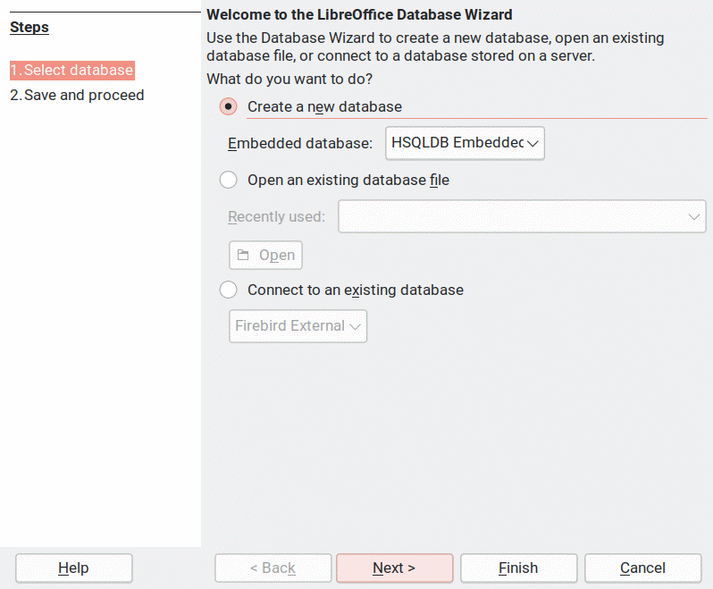
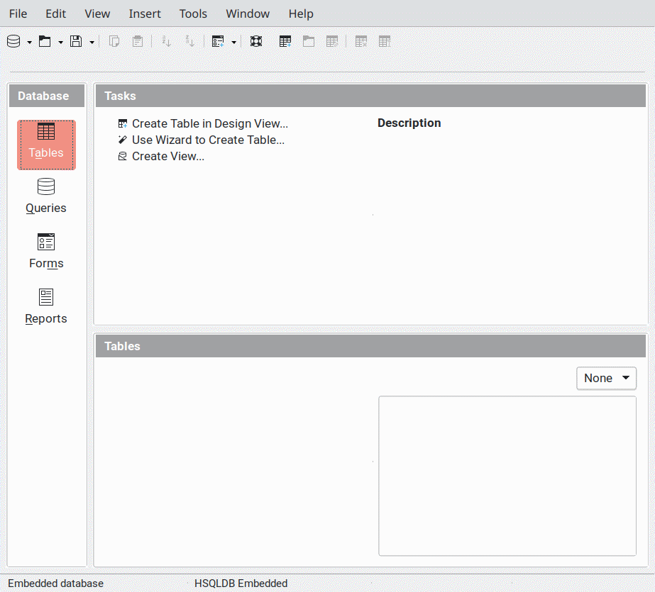
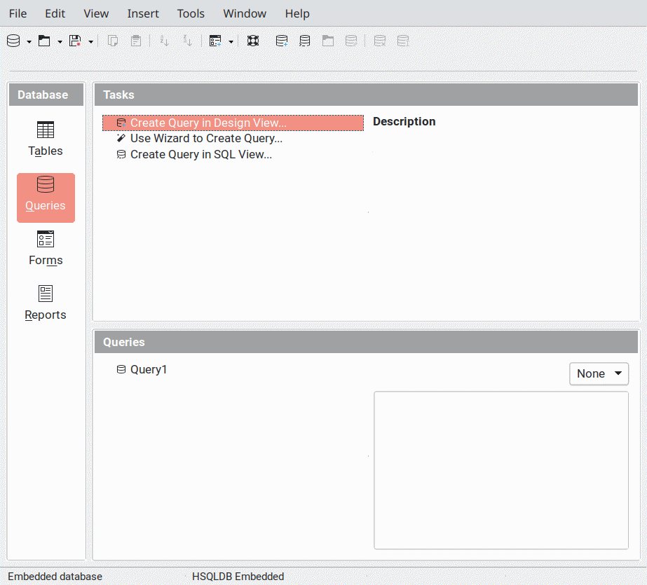
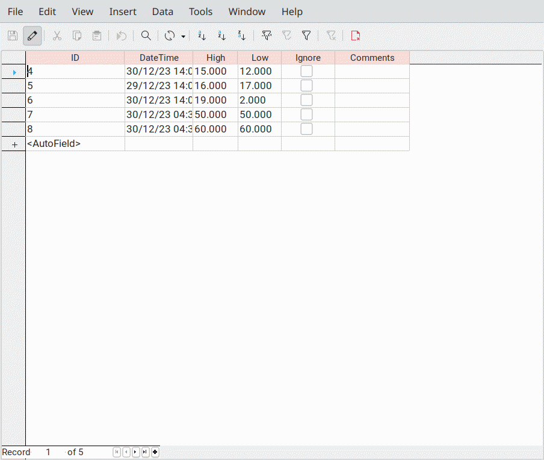
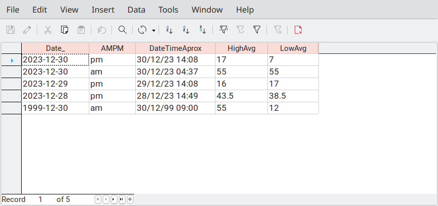
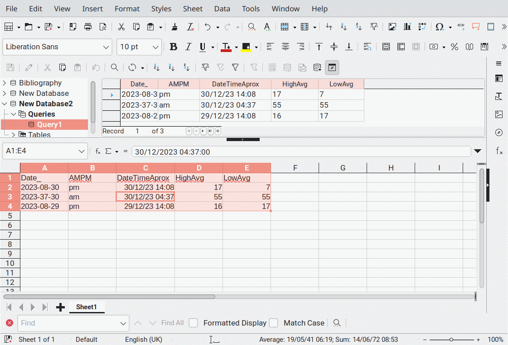

# Example of an SQL query in Libre Office Base that averages values, and grouped by date and am/pm

Just a quick set of instructions created for one reason or another,
your milage may vary.

## Getting started with Open Office Base

 1. Open LibreOffice Base. (The wizard should open.)



 2. Next
 
 3. Defaults should be fine here - (Yes you do want to register the
    database and yes you do want to open it for editing, no you dont
    want to use create tables using the wizard).
	
 3. Finish



To save time we are going to create the table the easy way... 

 4. Tables Tab: `Menu Bar > Tools > SQL` (This methodshortcuts the
    creating a table process, and allows the adding for dynamic default
    values.)

 5. Copy and paste the query below into the `Command to execute` and
    press `execute`.

```sql
CREATE TABLE "Table1" (
     "ID" INT GENERATED BY DEFAULT AS IDENTITY,
     "DateTime" TIMESTAMP DEFAULT NOW,
     "High" DECIMAL(8,3),
     "Low" DECIMAL(8,3), 
     "Ignore" BOOLEAN,
     "Comments" VARCHAR(1024)
 )
```
 6. Click `Close`

 7. Click `Menu Bar > View > Refresh Tables` (Table 1 will now
    appear.)

 8. Click `Queries` to go to the queries tab.



 9. Click the `"Create Query in SQL View…”` option on the main window,
    this will open a query window.

 10. Copy and past the query below:

```sql
SELECT
     -- Date has an underscore after it as Date is a keyword.
     TO_CHAR("DateTime", 'YYYY-MM-DD') AS Date_,
     TO_CHAR("DateTime", 'a') AS AMPM,
     MIN("DateTime") AS DateTimeAprox,
     -- This Averages the figures based on the Group By below.
     AVG("High") AS HighAvg,
     AVG("Low") AS LowAvg
 FROM "Table1"
 WHERE "Ignore" != True
 -- This Groups it by date and AM and PM
 GROUP BY TO_CHAR("DateTime", 'YYYY-MM-DD-a' )
 -- This Orders it by date so that the latest entries appear at the top.
 ORDER BY MIN("DateTime") DESC 
```

 11. `[Ctrl-S]` A Save as window will appear; call the Query:
     "Query1". Click `OK`.
	 
 12. Close Query Design Window. (Query1 will appear under Queries.)

## Filling in the database / How to use.

 1. Open Table1, and put data into Table1; use `[Tab]` to move across
    as normal.  The DateTime field will fill automatically when you
    have finished and moved onto the next row. (You can edit the date
    / time after it appears)

 2. `[Ctrl-S]` To save your changes.

Query1 just does the calculations for you, and is used in Calc. You
can open it out of curiosity, but you don't need to do anything with
it.





## Connecting the database to your spreadsheet

Next you connect your calc spreadsheet to your database…

 1. Open LibreOffice Calc.

 2. Click `Menu Bar > View > Data Soures` or `[Ctrl-Shift-F4]`

 3. Click on the little arrow next to your databae and next to queries
    then Drag and Drop Query1 to Cell A1.
	


 4. Close Data Sources by clicking `Menu Bar > View > Data Soures` or
    `[Ctrl-Shift-F4]`.

 5. Optional - Make pretty chart as desired.

 6. Save your spreadsheet.

## Normal Operation

 1. Open your database
 
 2. Fill in `Table1` with data - If you tick “Ignore”, that row will
    not be included in “Query1” that does the averaging.
 
 3. Save your new database.
 
 4. Close the database.

 5. Open your spreadsheet.
 
 6. Click on Cell A1 of the database data and click Menu Bar > Data >
    Refresh Range. This will update the spreadsheet from the database,
    your chart should also update.

## Reference Documentation

Refrence manuals for the HSLQDB, which OpenOffice Base uses as its
local default can be found through the link below:

 * https://hsqldb.org/doc/2.0/guide/
